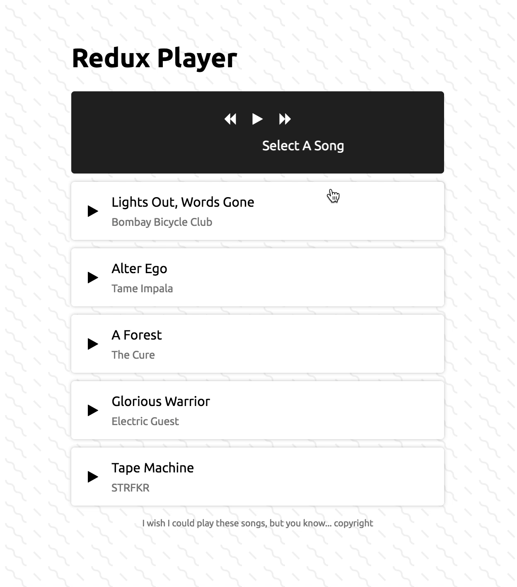
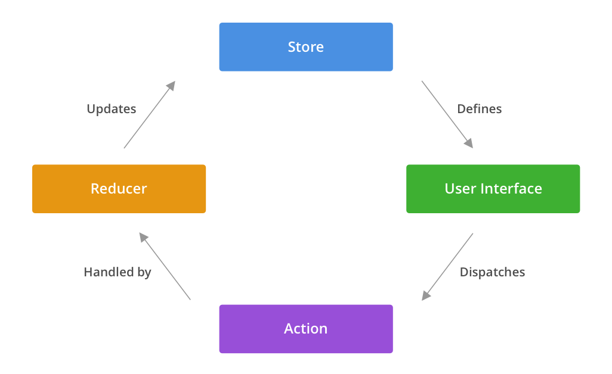
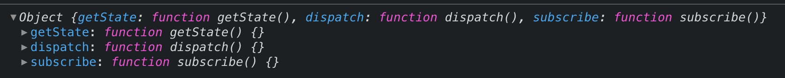
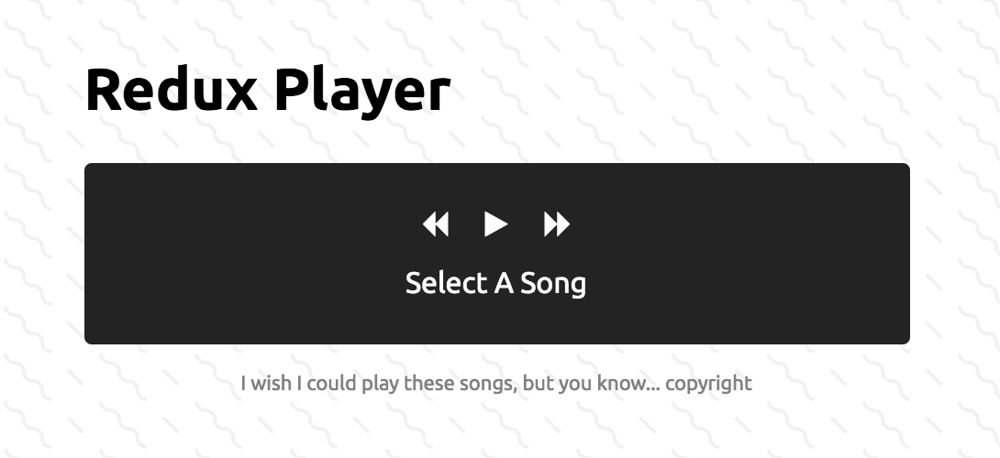
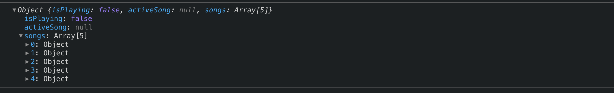

The first time I saw Redux being used in a React application, I had no idea what was going on. Everything was just _connected_ and updating immediately. There were higher order functions everywhere and simple words like "action" or "type" suddenly meant something way more important.

Apart from reading [the documentation](https://redux.js.org/), what made everything click for me was trying to work out what was going on behind the scenes. Over time I've grown to approach other complex libraries like this and encourage others to really understand _how_ a library works, not just how to _use it_ -- their concepts are often worth more than the library itself.

In this post we'll be exploring how Redux works at its core and then building it from the ground up to power a simple music player application. Every Redux tutorial out there builds a counter. This will be more fun, I promise.

Here's the [CodeSandbox](https://codesandbox.io/s/eg3lb).

And here's what it'll look like:



---

## What is Redux?

**Note:** if you already know how Redux works, you can skip to the [Let's Begin](#lets-begin) section.

> Redux is a predictable state container for JavaScript apps.

That is the official description of Redux, but what does it mean? At the heart of Redux is a single JavaScript object that we all know. That object, known as the Store, holds the state of your application and is the only place where app-wide state can live. Things like `user.isLoggedIn` or `shoppingCart.length` would live in there since, most likely, many different parts of your application need to be aware of those things as they change. This global object is the "state container" part of the quote above.

The state container is "predictable" because there is only one state container for the entire application and there is only one way to update it, which we'll soon go into. Redux allows you to have different parts of your application subscribe to this global state and listen for changes.

## How Does Redux Work?

Redux works by using the [Publish/Subscribe](https://en.wikipedia.org/wiki/Publish%E2%80%93subscribe_pattern) pattern. In this paradigm, subscribers listen to topics or areas of interest which, in this case, can be slices of your app's global state. When those things change, the subscribers will immediately be made aware of the changes.

In the context of a React application, for example, we can think of components as subscribers of the Store. These components are known as "connected components" in order to distinguish them from those that are not aware of the Store; remember, not every component will care about the app's global state and there are various methods used to ensure that only a minimal set of them are connected to make it easier to reason about your application's logic. In Redux, data flows unidirectionally and there is one _and only one_ way you should update and receive data from the Store.



Conceptually, components or other parts of your UI dispatch Actions when a user interacts with the application or an event needs to be handled. The individual Actions are handled by one or many Reducers whose job is to update the Store in a very specialized way which we'll get to later on. Once the Store is updated with the new state, all the connected components that are listening for those changes are fed the new state to handle it as they wish. That's basically it. The key takeaway here is that data flows in _one_ direction starting with a user interaction and ultimately defines the next state of the UI.

Redux gives you methods to handle data flow but relies on you, the developer, to implement it in such a way that honors the flow above.

> The beauty of this flow is that, given a UI state and any Action, the next state of the UI can be determined without ambiguity. This is what makes Redux predictable.

Any idiomatic Redux application implements this flow and thus understanding it deeply will help you navigate any application using the library smoothly.

---

Let's quickly go over what makes up Actions and Reducers. Remember, the Store is still just a global object with your app's state and your UI can be listening to parts of it.

### Actions

**Actions** are objects with one required field called `type` that describe, well, any action or event that took place in your application. Each `type` must be unique so that Redux can handle them individually. Here are a couple of examples:

```js
const ADD_ITEM = { type: "CART.ADD_ITEM" }
const REMOVE_ITEM = { type: "CART.REMOVE_ITEM" }
const LOG_IN_ATTEMPT = { type: "USER.LOG_IN_ATTEMPT" }
const LOG_IN_FAILURE = { type: "USER.LOG_IN_FAILURE" }
```

This is what I was alluding to earlier in the post; the concept of an Action is much greater than the actual implementation. They're literally just objects. Naming them is more of an art than a science.

You might be thinking "Okay, a user can interact with my UI which will dispatch an Action that has the type 'CART.ADD_ITEM', but at what point do I specify which item was added?" Apart from `type`, each Action object is completely up to you to define. In the case above, we can make each Action a bit more useful by providing not just what happened but also some context. In order to make these unique Actions take in dynamic values, we wrap them in a function known as an **Action Creator** which does exactly what it sounds like it does.

```js
const addItem = itemToAdd => {
  return { type: "CART.ADD_ITEM", item: itemToAdd }
}

const removeItem = itemToRemove => {
  return { type: "CART.REMOVE_ITEM", item: itemToRemove }
}
```

90% of Actions you'll come across will do the above with varying degrees of complexity. A good rule of thumb is to keep your Action Creators simple. You'll thank yourself later.

### Reducers

So we now know how to represent different things taking place in your application with Actions, but how does that get "handled" by a Reducer?

**Reducers** are simply functions that take in the current state of the application along with an Action and return the new updated state as a result of processing the Action. Let's make an example to handle the two Actions we created above.

```js

const initialState = {
  items: [],
}

const CartReducer = (state = initialState, action) => {
  switch (action.type) {
    case: 'ADD_ITEM':
      return {
        ...state,
        items: [...state.items, action.itemToAdd],
      }

    case: 'REMOVE_ITEM':
      return {
        ...state,
        items: state.items.filter(item => item === action.itemToRemove),
      }

    default:
      return state
    }
  }
}

```

As you can see, our `CartReducer` takes in the current state of the application and an Action. It then handles each Action `type` by returning a new copy of the state with updates. Note how we default the `state` argument to the initial state. This helps us write less code later on and provides a nice fallback when your application starts. Another key point is that our Reducer returns the unchanged state if it can't handle the given Action. This increases your application's robustness as it won't break if you accidentally mistype an Action. The worst it can do is not update your Store.

The most important part of Reducers is that **they never modify state. Instead, they return a brand new copy of the state with changes caused by Actions**. Redux emphasizes this level of immutability. By never mutating existing state, you significantly reduce the number of unanticipated side effects of your application. This is definitely a topic worth a post on its own, but for now it's just important to understand that Reducers should never modify the Store.

One important characteristic of Reducers is that they never care about why or how an Action came to be. They simply process the Action and return the next state and nothing else. Reducers can be as simple as the one shown above or a bit more complex, but at their core they don't change. [The docs](https://redux.js.org/basics/reducers) show a couple of advanced examples if you'd like to learn more.

---

Now that we understand how Actions, Reducers, and the Store work, it should be easier to grasp the 3 fundamental principles of Redux.

1. **Single Source of Truth**: The Store holds the state of your entire application
2. **State is Read-Only**: State is never mutated directly but rather updated via dispatched Actions and Reducers
3. **Changes Are Made With Pure Functions**: Reducers should always return a brand new state object every time

## Let's Begin

Redux's API footprint is actually quite small. Most of the code you write in a Redux app is your own. Redux only exports 5 top-level methods and we'll be implementing 4 of them:

- `createStore(reducer)`
- `combineReducers(reducers)`
- `applyMiddleware(middleware)`
- `bindActionCreators(actionCreators, dispatch)`

I'm purposely skipping over `compose(...functions)` as it's not crucial to this exercise. Because of this, `applyMiddleware` only takes one middleware function instead of `...middleware` which the official Redux API handles. We'll also be skipping over error handling for brevity.

We'll be using Redux's [API Reference](https://redux.js.org/api/api-reference) as our spec so that you can feel familiar with the variable names in their [source code](https://github.com/reduxjs/redux) or docs.

### createStore

This method creates a Redux Store that holds you app's state. This Store also provides methods to attach listeners, dispatch Actions, and retrieve the current state.

```js
/**
 * Creates a Redux store which will hold all our application
 * state.
 */
export const createStore = reducer => {
  /**
   * This is where our global application state
   * will live.
   *
   * Notice the use of `let` here -- we won't ever
   * be mutating the state directly but instead
   * replacing it with the next state each time.
   */
  let state

  /**
   * This will hold a list of referneces to listener
   * functions that we'll fire when the state changes.
   *
   * Any time a part of our UI subscribes to our store,
   * we'll add that to this list.
   */
  const listeners = []

  /**
   * Returns the current state of the Store.
   */
  const getState = () => state

  /**
   * Dispatches an action to trigger a state change
   * and then invokes all listeners.
   */
  const dispatch = action => {
    state = reducer(state, action)
    listeners.forEach(listener => listener())

    /**
     * We return the Action so that we can chain Actions
     * in other parts of our application.
     */
    return action
  }

  /**
   * Add a subscription to our list of listeners.
   */
  const subscribe = listener => {
    listeners.push(listener)

    /**
     * Return an unsubscribe function to allow consumers
     * to remove the given listener.
     */
    return function unsubscribe() {
      const idx = listeners.indexOf(listener)
      listeners.splice(idx, 1)
    }
  }

  return { getState, dispatch, subscribe }
}
```

As you can see, the Store isn't anything special. It takes in a Reducer and just holds an object that gets reassigned each time that Reducer processes an action. The Store keeps track of all subscriptions in the `listeners` array and invokes each listener whenever an Action is dispatched via `dispatch`. We also created a `getState` method so that your UI can always reach into the global app state when needed.

The `subscribe` method also returns an unsubscribe method which allows the consumer of Redux to stop listening to the Store at any given moment. This is crucial for apps where performance is key and many things are listening to the Store.

Technically this is the only method that you need to provide in order for a consumer to start using your Store, however Redux also provides some utility methods while we'll implement below.

### combineReducers

This is one of Redux's most commonly used utility methods, and it's very self-descriptive. I'm a fan of the name.

As your app grows in complexity, you'll start to notice that one giant Reducer for your app's state is hard to maintain. Instead, most developers create individual Reducers for slices of state and then compose (or combine, in this case) them into one giant Reducer which gets fed into `createStore`.

Arguments to `combineReducers` look like this:

```js
const appReducer = combineReducer({ user: userReducer, cart: cartReducer })
```

The provided `user` and `cart` keys allows Redux to namespace each Reducer to avoid any name clashing with your Action types. Here's one way we could implement it:

```js
/**
 * Combines multiple reducers that deal with individual
 * slices of state into one big app reducer.
 *
 * This composed reducer is typically what is fed into
 * `createStore`.
 */
export const combineReducers = reducers => {
  const reducerKeys = Object.keys(reducers)
  function combinedReducer(state = {}, action) {
    const nextState = {}
    reducerKeys.forEach(key => {
      nextState[key] = reducers[key](state[key], action)
    })
    return nextState
  }

  return combinedReducer
}
```

As you can see, `combineReducers` simply takes each key from the arguments and returns a brand new composed Reducer function called `combinedReducer`. This combined Reducer returns the next state the same way any normal Reducer would but also namespaces the state. Let's walk through an example for clarity.

We'll create two Reducers that deal with two disjointed parts of the app's global state.

```js
const initialState = {
  profile: {},
  loggedIn: false,
  lastUpdated: null
}

const userReducer = (state = initialState, action) => {
  switch (action.type) {
    case "LOG_IN":
      return {
        ...state,
        profile: action.profile
        loggedIn: true,
        lastUpdated: Date.now()
      }

    case "LOG_OUT":
      return {
        ...state,
        profile: {},
        loggedIn: false,
        lastUpdated: Date.now()
      }

    default:
      return state
  }
}
```

```js
const initialState = {
  items: [],
  lastUpdated: null
}

const cartReducer = (state = initialState, action) => {
  switch (action.type) {
  case: 'ADD_ITEM':
    return {
      ...state,
      items: [...state.items, action.itemToAdd],
      lastUpdated: Date.now()
    }

  case: 'REMOVE_ITEM':
    return {
      ...state,
      items: state.items.filter(item => item === action.itemToRemove),
      lastUpdated: Date.now()
    }

  default:
    return state
  }
}
```

Next, let's combine them into one big Reducer we'll call `appReducer`. Notice how both of these state Reducers have a field called `lastUpdated`. Our `combineReducers` function will have no problems avoiding a name clash here.

```js
import { createStore, combineReducers } from "redux"

const appReducer = combineReducers({
  user: userReducer,
  cart: cartReducer,
})

const store = createStore(appReducer)
```

Now our combined state looks like this:

```js
const state = {
  user: {
    profile: {},
    loggedIn: false,
    lastUpdated: null,
  },
  cart: {
    items: [],
    lastUpdated: null,
  },
}
```

Each time an Action is dispatched, Redux will process it through the merged Reducer and only the relevant state will be updated. As you can probably tell, this is very useful when you have really complex state objects or many small isolated ones in your application. Working in isolation on a single Reducer and knowing you won't be affecting an unrelated part of your app's state is one of the best features of Redux.

### applyMiddleware

In the [How Does Redux Work?](#how-does-redux-work) section above, I briefly described the flow of data in Redux. You'll notice that Actions get dispatched directly into Reducers. In Redux, middleware is the suggested way to wrap our Store's `dispatch` method to let the consumer intercept an Action and do whatever they please. A middleware function typically looks like this:

```js
const loggerMiddleware = store => next => action => {
  console.log("About to dispatch", action)
  const nextValue = next(action)
  console.log("Action processed. Next state:", store.getState())
  return nextValue
}
```

I'll admit that the Redux middleware syntax isn't easy to digest at first. It's a function that returns a function that returns a function. But there's a reason for this madness.

The first function takes a Redux `store` as its only parameter and it returns a curried function where that `store` context is already set. The subsequent function takes a `next` function as its only parameter which is a function that allows you to process the next dispatched Action. The final function of this middleware takes an `action` parameter which is the original Action that was directly dispatched and wrapped. This function signature lends itself very nicely to composability and is the main reason why the Redux authors chose it. If you'd like to learn more about currying, [check out this article](https://blog.bitsrc.io/understanding-currying-in-javascript-ceb2188c339).

A good way to think of middleware is to think of them as functions that wrap other Actions. In the case above, our middleware simply logs what is about to happen and then continues the data flow chain by calling `next(action)`. The `next` function is the most important part of this whole thing. It means you can process the next Action when you want to, including but not limited to asynchronous events.

This function might look something like this if we had to write it ourselves:

```js
/**
 * Wraps `dispatch` functions with the provided middleware
 * function.
 */
export const applyMiddleware = middleware => {
  return createStore => reducer => {
    const store = createStore(reducer)
    return {
      ...store,
      dispatch: function dispatch(action) {
        return middleware(store)(store.dispatch)(action)
      },
    }
  }
}
```

Our function returns what's known as an "enhanced store" now that the middleware has been added. Notice how we return a new Store and all its methods but overwrite the `dispatch` method to apply our middleware. Using our function looks like this:

```js
import { createStore, applyMiddleware } from "redux"
import appReducer from "./reducers"

const logger = store => next => action => {
  console.log("About to dispatch", action)
  const nextValue = next(action)
  console.log("Action processed. Next state:", store.getState())
  return nextValue
}

const enhancedStore = applyMiddleware(logger, createStore, appReducer)
```

If you've dealt with a large asynchronous Redux application, chances are you've used `redux-thunk`, a library that at the time of this writing has 6m downloads per month. `redux-thunk` is an example of middleware. In fact, [it's only 14 lines of code](https://github.com/reduxjs/redux-thunk/blob/master/src/index.js) and I encourage you to check it out now that you have a better understanding of how Redux will handle it.

### bindActionCreators

Last but definitely not least is `bindActionCreators`. The typical way to dispatch an Action Creator looks like this:

```js
store.dispatch(userActions.logIn(profile))
store.dispatch(userActions.logOut())
store.dispatch(cartActions.addItem(item))
// ...
```

Recall that our `createStore` returns a Store object with a `dispatch` method set up to handle Actions for the state it contains. Because of this, we must call `store.dispatch()` each time we want to update the state. This quickly becomes overhead since you most likely will only have one Store for you application and are always executing within its context.

Redux's `bindActionCreators` takes Action Creators and wraps them in a given Store `dispatch` method for you. It's such a simple function conceptually but saves you so much time in the long run. It can be implemented in the following way:

```js
/**
 * Wraps Action Creators in `dispatch` calls for the consumer so
 * that they don't have to call `store.dispatch(ActionCreator.something())`
 * each time.
 */
export const bindActionCreators = (actionCreators, dispatch) => {
  const boundedActionCreators = {}
  const actionKeys = Object.keys(actionCreators)
  actionKeys.forEach(key => {
    const actionCreator = actionCreators[key]
    boundedActionCreators[key] = function boundedActionCreator() {
      return dispatch(actionCreator.apply(this, arguments))
    }
  })
  return boundedActionCreators
}
```

In this implementation, we map over each Action Creator in the `actionCreators` object and return a new version of it where `dispatch` is always called for the consumer. In the end, we return a "bounded" version of these Action Creators so that we can use them as such:

```js
import { bindActionCreators } from "redux"
import { userActions, cartActions } from "./actions"
import store from "./store"

const boundedUserActions = bindActionCreators(userActions, store.dispatch)

const boundedCartActions = bindActionCreators(cartActions, store.dispatch)

// Dispatching Actions
boundedUserActions.logIn(profile)
boundedUserActions.logOut()
boundedCartActions.addItem(item)
```

## Building a Music Player

Now that we've built our core Redux functions, let's create a simple application that uses them. Our app will store a list of songs, show the currently playing song, and also allow the user to go forwards and backwards through the available songs.

Our app's file structure will look like this:

```
app
│   index.html
│   redux.js
│
└───src
│   │   index.js
│   │   redux.js
│   │   songs.json
│   │   songActions.js
│   │   songReducer.js
│   │   styles.css
```

Each file is sort of self explanatory. `src/index.js` will hold our app's logic. `redux.js` will house our implementation of Redux. `songs.json` is our hardcoded list of songs. `songActions.js` and `songReducer.js` will store the Action Creators and Reducer for our app's state, respectively.

Using what we've created in the previous section, our final `redux.js` should look like this:

```js
/**
 * Creates a Redux store which will hold all our application
 * state.
 */
export const createStore = reducer => {
  /**
   * This is where our global application state
   * will live.
   *
   * Notice the use of `let` here -- we won't ever
   * be mutating the state directly but instead
   * replacing it with the next state each time.
   */
  let state

  /**
   * This will hold a list of referneces to listener
   * functions that we'll fire when the state changes.
   *
   * Any time a part of our UI subscribes to our store,
   * we'll add that to this list.
   */
  const listeners = []

  /**
   * Returns the current state of the Store.
   */
  const getState = () => state

  /**
   * Dispatches an action to trigger a state change
   * and then invokes all listeners.
   */
  const dispatch = action => {
    state = reducer(state, action)
    listeners.forEach(listener => listener())

    /**
     * We return the Action so that we can chain Actions
     * in other parts of our application.
     */
    return action
  }

  /**
   * Add a subscription to our list of listeners.
   */
  const subscribe = listener => {
    listeners.push(listener)

    /**
     * Return an unsubscribe function to allow consumers
     * to remove the given listener.
     */
    return function unsubscribe() {
      const idx = listeners.indexOf(listener)
      listeners.splice(idx, 1)
    }
  }

  return { getState, dispatch, subscribe }
}

/**
 * Combines multiple reducers that deal with individual
 * slices of state into one big app reducer.
 *
 * This composed reducer is typically what is fed into
 * `createStore`.
 */
export const combineReducers = reducers => {
  const reducerKeys = Object.keys(reducers)
  function combinedReducer(state = {}, action) {
    const nextState = {}
    reducerKeys.forEach(key => {
      nextState[key] = reducers[key](state[key], action)
    })
    return nextState
  }

  return combinedReducer
}

/**
 * Wraps `dispatch` functions with the provided middleware
 * functions. Notice the curried functions.
 */
export const applyMiddleware = (...middlewares) => {
  return createStore => reducer => {
    const store = createStore(reducer)
    return {
      ...store,
      dispatch: function dispatch(action) {
        /**
         * Replace `store.dispatch` with `next` if you need to
         * support composed middlewares.
         */
        return middlewares(store)(store.dispatch)(action)
      },
    }
  }
}

/**
 * Wraps Action Creators in `dispatch` calls for the consumer so
 * that they don't have to call `store.dispatch(ActionCreator.something())`
 * each time.
 */
export const bindActionCreators = (actionCreators, dispatch) => {
  const boundedActionCreators = {}
  const actionKeys = Object.keys(actionCreators)
  actionKeys.forEach(key => {
    const actionCreator = actionCreators[key]
    boundedActionCreators[key] = function boundedActionCreator() {
      return dispatch(actionCreator.apply(this, arguments))
    }
  })
  return boundedActionCreators
}
```

Let's create the markup for our basic music player in our `index.html` file.

```html
<!DOCTYPE html>
<html>
  <head>
    <title>Build Your Own Redux</title>
    <meta charset="UTF-8" />
    <link
      rel="stylesheet"
      href="https://stackpath.bootstrapcdn.com/font-awesome/4.7.0/css/font-awesome.min.css"
    />
    <link rel="stylesheet" href="./src/styles.css" />
  </head>
  <body>
    <h1>Redux Player</h1>
    <div class="player-wrapper">
      <div class="player-controls">
        <i id="prevIcon" class="fa fa-backward" aria-hidden="true"></i>
        <i id="playPauseIcon" class="fa fa-play"></i>
        <i id="nextIcon" class="fa fa-forward" aria-hidden="true"></i>
      </div>
      <span id="activeSong">Select A Song</span>
    </div>
    <ul class="song-list"></ul>
  </body>
</html>
```

We've specifically given a few elements ids so that we can update their content once we connect them to Redux. Our `src/styles.css` would look like this:

```css
body {
  font-family: Roboto, Oxygen, Ubuntu, Cantarell, "Open Sans", "Helvetica Neue",
    sans-serif;
  max-width: 450px;
  display: flex;
  flex-direction: column;
  margin: 0 auto;
  background-color: #ffffff;
  background-image: url("data:image/svg+xml,%3Csvg width='52' height='26' viewBox='0 0 52 26' xmlns='http://www.w3.org/2000/svg'%3E%3Cg fill='none' fill-rule='evenodd'%3E%3Cg fill='%23cacaca' fill-opacity='0.25'%3E%3Cpath d='M10 10c0-2.21-1.79-4-4-4-3.314 0-6-2.686-6-6h2c0 2.21 1.79 4 4 4 3.314 0 6 2.686 6 6 0 2.21 1.79 4 4 4 3.314 0 6 2.686 6 6 0 2.21 1.79 4 4 4v2c-3.314 0-6-2.686-6-6 0-2.21-1.79-4-4-4-3.314 0-6-2.686-6-6zm25.464-1.95l8.486 8.486-1.414 1.414-8.486-8.486 1.414-1.414z' /%3E%3C/g%3E%3C/g%3E%3C/svg%3E");
  margin-top: 50px;
}

#activeSong {
  display: inline-block;
  padding-left: 100%;
  white-space: nowrap;
  animation: marquee 4s linear infinite;
}

.disclaimer {
  font-size: 11px;
  color: gray;
  margin: 5px auto;
}

.player-wrapper {
  background: #232323;
  color: white;
  margin-bottom: 10px;
  border-radius: 4px;
  padding: 25px;
  display: flex;
  flex-direction: column;
  align-items: center;
}
.player-controls {
  display: flex;
  align-items: center;
  margin-bottom: 5px;
}
.player-controls i {
  margin: 0px 10px 10px 10px;
  cursor: pointer;
}

.song-list {
  list-style-type: none;
  margin: 0;
  padding: 0;
}
.song-item {
  box-shadow: 0px 0px 4px rgba(136, 136, 136, 0.5);
  background-color: white;
  border-radius: 4px;
  padding: 15px;
  display: flex;
  align-items: center;
  transition: all 0.2s ease-out;
  cursor: pointer;
  margin-bottom: 10px;
  border-left: 5px solid transparent;
}
.song-item.active {
  border-left: 5px solid #3179e4;
}
.song-item:hover {
  background-color: rgba(249, 249, 249, 0.97);
}
.song-controls {
  margin-right: 16px;
}

.song-content-artist {
  display: block;
  margin-top: 8px;
  color: gray;
  font-size: 13px;
}

@keyframes marquee {
  0% {
    transform: translate(0, 0);
  }
  100% {
    transform: translate(-100%, 0);
  }
}
```

Our `src/songs.json` looks like this. You could change the names of the songs, but that would really hurt.

```json
[
  {
    "title": "Lights Out, Words Gone",
    "artist": "Bombay Bicycle Club"
  },
  { "title": "Alter Ego", "artist": "Tame Impala" },
  { "title": "A Forest", "artist": "The Cure" },
  { "title": "Glorious Warrior", "artist": "Electric Guest" },
  { "title": "Tape Machine", "artist": "STRFKR" }
]
```

---

Okay, enough setup. Let's start using our Redux implementation. Before diving deep in Reducers and Actions, I usually take a few minutes to think about what our state will look like.

```js
const initialState = {
  isPlaying: false,
  activeSong: null,
  songs: [],
}
```

Not the most complex state in the world, but it's enough to power our simple app. Next, we'll jump into our `src/songActions.js` file by creating some Action Creators for our song Reducer which we'll write next.

```js
const loadSongs = songs => ({ type: "LOAD_SONGS", songs })
const playSong = song => ({ type: "PLAY_SONG", song })
const togglePlay = () => ({ type: "TOGGLE_PLAY" })
const playNext = () => ({ type: "PLAY_NEXT" })
const playPrev = () => ({ type: "PLAY_PREV" })

export default { loadSongs, playSong, togglePlay, playNext, playPrev }
```

And our `src/songReducer.js`:

```js
/**
 * Our app's initial state.
 */
const initialState = {
  isPlaying: false,
  activeSong: null,
  songs: [],
}

/**
 * Reducer for our 'Song' slice of state.
 */
const songReducer = (state = initialState, action) => {
  const actionMap = {
    LOAD_SONGS: () => ({
      ...state,
      songs: action.songs,
    }),
    PLAY_SONG: () => ({
      ...state,
      isPlaying: true,
      activeSong: action.song,
    }),
    TOGGLE_PLAY: () => ({
      ...state,
      isPlaying: !state.isPlaying,
    }),
    PLAY_NEXT: () => {
      if (!state.activeSong) {
        return {
          ...state,
          isPlaying: true,
          activeSong: state.songs[0],
        }
      }
      const activeSongIndex = state.songs.indexOf(state.activeSong)
      const nextSong = state.songs[(activeSongIndex + 1) % state.songs.length]
      return {
        ...state,
        isPlaying: true,
        activeSong: nextSong,
      }
    },
    PLAY_PREV: () => {
      if (!state.activeSong) {
        return {
          ...state,
          isPlaying: true,
          activeSong: state.songs[0],
        }
      }
      const activeSongIndex = state.songs.indexOf(state.activeSong)
      const prevSong = state.songs[(activeSongIndex - 1) % state.songs.length]
      return {
        ...state,
        isPlaying: true,
        activeSong: prevSong,
      }
    },
  }

  // highlight-next-line
  return actionMap[action.type]() || state
}

export default songReducer
```

Our song Reducer handles the provided Action types we just created and updates the state accordingly. In this particular case, I chose to make the Action handlers a map with a corresponding function and invoke them as shown in the highlighted line above. This is purely stylistic -- I just prefer how this looks to switch/case statements but the end result is the same.

Our `PLAY_NEXT` and `PLAY_PREV` handlers also gracefully handle going out of bounds of our `state.songs` array by circling back to the beginning as a normal music player would.

We now have our styles, markup, Reducer, Action Creators, and song data. All that's left is connecting everything to make our UI shine.

---

We'll start in our `src/index.js` by importing our own Redux functions, creating our Store, and storing references to our DOM for easy updates later on.

```js
// Import our newest creation...
import { createStore } from "./redux"

// Stuff for Redux.
import songs from "./songs"
import songReducer from "./songReducer"
import songActions from "./songActions"

/**
 * Collection of DOM element references to save us time.
 */
const elements = {
  player: {
    activeSong: document.getElementById("activeSong"),
    playPauseIcon: document.getElementById("playPauseIcon"),
    nextIcon: document.getElementById("nextIcon"),
    prevIcon: document.getElementById("prevIcon"),
  },
  songList: document.querySelector(".song-list"),
}

/**
 * Create our application Store -- the single source of truth
 * for app state.
 */
const store = createStore(songReducer)
```

At this point, if we `console.log()` our `store` reference, we should see the methods we created on it:



Next, let's link our `src/index.js` to our `index.html` file so we can use it.

```html
<head>
  <title>Build Your Own Redux</title>
  <meta charset="UTF-8" />
  <link
    rel="stylesheet"
    href="https://stackpath.bootstrapcdn.com/font-awesome/4.7.0/css/font-awesome.min.css"
  />
  // highlight-next-line
  <script src="src/index.js"></script>
</head>
```

Now we can create a subscription to our Store for the player.

```js
/**
 * Create a listener for the player's state and handle the UI
 * updates.
 */
store.subscribe(() => {
  const { activeSong, isPlaying } = store.getState()
  if (activeSong) {
    elements.player.activeSong.innerHTML = `${activeSong.title} - ${
      activeSong.artist
    }`
  }
  if (isPlaying) {
    elements.player.playPauseIcon.classList.add("fa-pause")
  } else {
    elements.player.playPauseIcon.classList.remove("fa-pause")
  }
})
```

This listener function gets added into our Store's 'listeners' array which will be called each time the state updates. In our case above, we simply deconstruct the parts of state that we care about and update our UI accordingly. At this point, our UI is connected and listening, but we don't have a way to update our state's `isPlaying` or `activeSong` field yet so our player should still say 'Select A Song'.



Let's bind our Action Creators to our Store's `dispatch` function so we can begin loading data into our state.

```js
import { createStore, bindActionCreators } from "./redux"

// ...

/**
 * Bind our Action Creators to our `dispatch` function so we
 * don't have to call `store.dispatch()` each time.
 */
const boundedActions = bindActionCreators(songActions, store.dispatch)

/**
 * Initialize our Store's state by loading all our songs.
 */
boundedActions.loadSongs(songs)
```

If we `console.log(store.getState())` we should see our songs loaded which means our `createStore` and `dispatch` functions are working as intended.



Now that our source of truth holds our list of songs, let's connect our UI to the store and render a list.

```js
/**
 * Create a song item element for each song in our global state.
 * Each song element will also have a click handler which will
 * dispatch an action to play the given song.
 */
const renderSongList = (songs, activeSong, isPlaying, actions) => {
  const fragment = document.createDocumentFragment()

  /**
   * Note: this is a really inefficient way of updating the DOM, but
   * that's outside the scope of this tutorial. For now, we just need
   * a way to refresh our `<ul>` song list DOM node with the latest
   * correct data.
   */
  while (elements.songList.firstChild) {
    elements.songList.removeChild(elements.songList.firstChild)
  }
  songs.forEach(song => {
    const li = document.createElement("li")
    const isActiveSong =
      isPlaying && activeSong && activeSong.title === song.title
    li.innerHTML = `
      <div class="song-item ${isActiveSong ? "active" : ""}">
        <div class="song-controls">
          <i class="fa ${isActiveSong ? "fa-pause" : "fa-play"}"></i>
        </div>
        <div class="song-content">
          <span>${song.title}</span>
          <span class="song-content-artist">${song.artist}</span>
        </div>
      </div>
    `
    li.addEventListener("click", () => {
      if (isActiveSong) {
        actions.togglePlay()
        return
      }
      actions.playSong(song)
    })
    fragment.appendChild(li)
  })
  elements.songList.appendChild(fragment)
}

/**
 * Create a listener for the full list of songs available so that we
 * can keep the list up to date.
 */
store.subscribe(() => {
  const { songs, activeSong, isPlaying } = store.getState()
  renderSongList(songs, activeSong, isPlaying, boundedActions)
})
```

Just like our first subscription, we've hooked into our Store's state and deconstructed the parts that we care about. For readability, I split `renderSongList` into its own function. This function updates our DOM to make sure our `ul.song-list` element always represents the latest data from our store. Since we're not using a UI rendering library, we had to go old school and manually remove/add child nodes to our DOM. Here, we map over our `songs` array and, for each `song`, we create a new `<li>` element to insert into the DOM while also adding a click handler for it. The click handler dispatches `playSong()` and `togglePlay()` when appropriate.

**Note:** It's important that we _first_ call `boundedActions.loadSongs()` before adding our subscriptions. Dispatching any action will trigger our subscription listener functions and if we create the subscription _after_ we dispatch, they'll miss handling the first time our Store updates.

At this point, your song list should be rendered and you should be able to click on any track to make it the `activeSong`. All that's left is connecting our player's backwards, forwards, and play/pause buttons to update the state, which we can do as shown:

```js
/**
 * Bind Action dispatchers to the player's control elements.
 */
elements.player.nextIcon.addEventListener("click", () => {
  boundedActions.playNext()
})
elements.player.prevIcon.addEventListener("click", () => {
  boundedActions.playPrev()
})
elements.player.playPauseIcon.addEventListener("click", () =>
  boundedActions.togglePlay()
)
```

And that's it! You should now have a fully connected UI that updates the app's state using our own implementation of Redux. :)

---

Like any complex library, Redux is grounded on certain principles which guide its logic flow and ultimately its API. What I hope to convey with this post is that most of Redux's best practices are left to the developer to implement and that's why it's crucial to understand why it works the way it does. I big ah-ha moment for me in my career was when I stopped blindly following documentation and took the time to understand why and how the library in question functions.

I hope not just that you have a better understanding of Redux, but that you can abstract what you've learned from this post and apply it to your own library.

Thanks for reading and happy state management!
